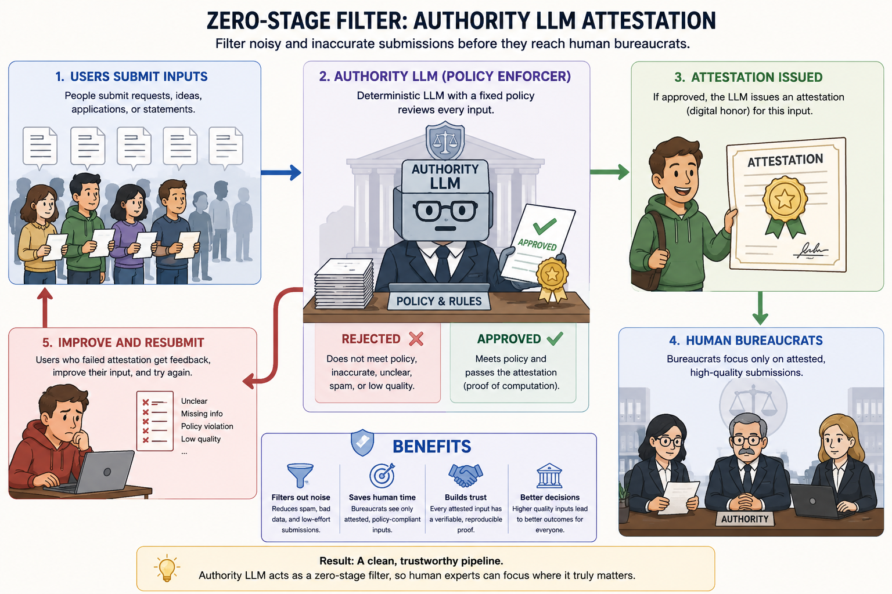

<h1 align="center">Deterministic DF16/DF32 inference and attestation</h1>

<p align="center"></p>

## Main idea

Indeterminism in LLMs—especially local, open-weight models—limits the range of applications in which their outputs can be trusted. A deterministic LLM combined with a fixed policy prompt could formally attest that a submitted input satisfies a defined policy.

Such an attestation would reduce noise from invalid, inaccurate, or low-value submissions while preserving meaningful input. By attaching proof that “this policy model approved this input,” users and policy makers could communicate through a shared, reproducible validation process.

Ordinary floating-point inference may vary slightly across GPUs, compilers, kernel schedules, and reduction orders, making exact reproducibility difficult. This project adds deterministic fixed-point arithmetic to tinygrad so that the same model, prompt, and execution schema produce exactly the same output on every conforming device, independently of the underlying hardware.

This is achieved by representing floating-point values using integer arithmetic. DF16 stores signed Q15.16 values in 32 bits, while DF32 stores signed Q31.32 values in 64 bits. Arithmetic, rounding, saturation, transcendental approximations, and reduction graphs are explicitly defined, and all underlying operations are performed using integers. CUDA may still execute independent work in parallel, but operations whose order can affect the result use custom kernels with fixed dependency graphs.

The attestation system provides evidence that a specific computation was executed. It commits selected intermediate tensors to SHA-256, with 5–10 meaningful witnesses per layer. Producing a valid attestation therefore requires reproducing the complete computation using the defined arithmetic and execution schema.

Each token chains the ordered layer roots, and the final artifact binds the model weights, input tokens, generated text, and complete execution transcript into a final SHA-256 commitment. This is a reproducibility proof for a specific computation. 

## What is implemented

- DF16 and DF32 arithmetic on CPU and CUDA, including explicit rounding and
  saturation.
- Fixed reduction DAGs for sums, maxima, matrix products, RMSNorm, attention,
  softmax, residuals, SiLU, and token selection.
- Deterministic integer-generated RoPE sine/cosine tables.
- Dense Llama execution with KV-cache state witnesses.
- Canonical SHA-256 framing, tensor Merkle roots, ordered roots, diagnostic XOR,
  per-module witness chains, per-token chains, and JSON/text run artifacts.
- Integer-only CPU conversion of Q6_K matrices directly to canonical FP16.
- Integer-only CPU conversion of native F32 norm weights to canonical FP16.
- Byte-preserving upload of the resulting pure-FP16 model storage to CUDA;
  weights are converted to DF16 when consumed, while wider intermediates and
  accumulators use DF32.
- CPU/CUDA equality tests for individual operations, a complete small Llama
  block, greedy selection, KV updates, and the resulting attestation artifact.

The initial proof model is Llama-3.2-1B-Instruct Q6_K. Large model files should
be stored under `/mnt/pacer` (or another dedicated model disk), not in this
repository or a home-directory download cache.

## Run the CUDA model

Use Python 3.11 or newer and place `tokenizer.model` beside the GGUF file. Set
`DEV=CUDA`; the old `CUDA=1` selector is not supported by this tinygrad version.

```sh
DEV=CUDA python examples/llama3.py \
  --model /mnt/pacer/ai-models/tinygrad/llama3-1b-instruct/Llama-3.2-1B-Instruct-Q6_K.gguf \
  --size 1B --dfloat --low_memory --no_api --temperature 0 --seed 42
```

The command first decodes Q6_K and F32 source tensors on CPU with integer-only
conversion, uploads 147 canonical FP16 tensors, pre-fills the system prompt,
and opens an interactive `Q:` prompt. For the current smoke test enter:

```text
Tell me a story about a llama
```

The first token is slower because CUDA kernels compile. Later tokens reuse the
compiled programs.

## Run the tests

Focused deterministic conversion and arithmetic tests:

```sh
python -m pytest \
  test/dfloat/test_df_q6_load.py \
  test/dfloat/test_df_convert.py \
  test/dfloat/test_df16_cuda.py -q
```

CPU/CUDA model and attestation equality tests:

```sh
DEV=CUDA python -m pytest test/dfloat/test_df_cpu_cuda.py -q
```

Canonical SHA framing, pinned digests, schema, and artifact tests:

```sh
python -m pytest test/dfloat/test_df_attestation.py -q
```

The most important current checks are:

- `test_one_block_full_attestation`
- `test_one_block_selection_artifact`
- `test_two_token_kv_attestation`
- `test_q6_cpu_decode_then_upload_preserves_canonical_fp16`
- `test_integer_float32_to_fp16_matches_reference`

## Getting an attestation

Attestation is currently exposed as a Python API. Create one
`AttestationSession`, use it for every ordered token step, record greedy token
selection, then serialize the final document:

```python
import json
from extra.dfloat_attestation import AttestationSession
from extra.dfloat_attested_llama import attest_dense_llama_forward, attest_greedy_selection

session = AttestationSession()
logits, recorder = attest_dense_llama_forward(
  model, token_tensor, step=position, start_pos=position, session=session)
selected_token = attest_greedy_selection(logits, recorder)

artifact = session.artifact({
  "model": "Llama-3.2-1B-Instruct-Q6_K",
  "prompt_tokens": prompt_tokens,
  "sampling": "greedy",
}, generated_text)

with open("attestation.json", "w", encoding="utf-8") as f:
  json.dump(artifact, f, sort_keys=True, separators=(",", ":"))

with open("attestation.txt", "w", encoding="utf-8") as f:
  f.write(session.text_artifact(artifact))
```

For multiple generated tokens, repeat the forward and selection calls with
strictly increasing `step`/`position` before calling `session.artifact`.

Useful JSON fields are:

- `run_root`: final run commitment.
- `document_sha256`: commitment to the canonical artifact document.
- `weight_manifest_root`: commitment to persistent weights.
- `steps[].token_combined_root`: ordered per-token commitment.
- `steps[].ordered_boundary_root` and `steps[].boundary_xor`: ordered proof and
  parallel diagnostic aggregate.
- `steps[].modules[].witnesses`: intermediate layer witness names, tensor roots,
  and chained roots.

The full framing and witness specification is in
[`docs/dfloat-attestation-v1.md`](docs/dfloat-attestation-v1.md).

## Remaining work

- Run the complete 1B attested graph on both CPU and CUDA and compare complete
  artifacts. Small-model equality is already validated; a full independent-
  machine proof is not yet complete.
- Add a CLI exporter/verifier for `attestation.json`; the current interface is
  Python-only.
- Move tensor SHA-256/Merkle hashing to an optional accelerator sidecar. The
  current correctness-first recorder copies canonical tensor bytes to CPU and
  uses standard `hashlib` SHA-256.
- Produce and compare a complete persistent-weight manifest on another machine.
- Add integer-only canonical decoders for Q4/Q5/Q8 before claiming the same
  GGUF-level guarantee for models using those formats.
- Continue auditing compiler-defined shifts/conversions and inspect generated
  kernels for every fixed reduction/materialization boundary.
- Optimize witnessed full-model execution; the current implementation favors
  clarity and proof coverage over speed.

Detailed limitations and future work are tracked in
[`docs/dfloat-hard-determinism-todo.md`](docs/dfloat-hard-determinism-todo.md).


<div align="center">

<picture>
  <source media="(prefers-color-scheme: light)" srcset="/docs/logo_tiny_light.svg">
  
</picture>

tinygrad: For something between [PyTorch](https://github.com/pytorch/pytorch) and [karpathy/micrograd](https://github.com/karpathy/micrograd). Maintained by [tiny corp](https://tinygrad.org).

<h3>

[Homepage](https://github.com/tinygrad/tinygrad) | [Documentation](https://docs.tinygrad.org/) | [Discord](https://discord.gg/ZjZadyC7PK)

</h3>

[](https://github.com/tinygrad/tinygrad/stargazers)
[](https://github.com/tinygrad/tinygrad/actions/workflows/test.yml)
[](https://discord.gg/ZjZadyC7PK)

</div>

---

> This fork contains the deterministic DF16/DF32 inference and computation-attestation project.
> See [README.dfloat.md](README.dfloat.md) for the design, current status, tests, and usage.

---

tinygrad is an end-to-end deep learning stack:

- **Tensor library** with autograd
- **IR and compiler** that fuse and lower kernels
- **JIT + graph execution**
- **nn / optim / datasets** for real training

It’s inspired by PyTorch (ergonomics), JAX (functional transforms and IR-based AD), and TVM (scheduling and codegen), but stays intentionally tiny and hackable.

---

## How tinygrad compares

**PyTorch**

- ✅ Similar: eager `Tensor` API, autograd, `optim`, basic datasets and layers.
- ✅ You can write familiar training loops.
- 🔁 Unlike PyTorch, the entire compiler and IR are visible and hackable.

**JAX**

- ✅ IR-based autodiff over primitives (like JAXPR + XLA).
- ✅ Function-level JIT (`TinyJit`) that captures and replays kernels.
- 🔁 Fewer functional transforms (no full `vmap`/`pmap` yet), but far easier to read.

**TVM**

- ✅ Multiple lowering passes, scheduling, and BEAM search over kernels.
- ✅ Device “graphs” for batched execution.
- 🔁 tinygrad also ships the **front-end framework** (tensors, nn, optim), not just the compiler.

---

### Laziness

Try a matmul. See how, despite the style, it is fused into one kernel with the power of laziness.

```sh
DEBUG=3 python3 -c "from tinygrad import Tensor;
N = 1024; a, b = Tensor.empty(N, N), Tensor.empty(N, N);
(a.reshape(N, 1, N) * b.T.reshape(1, N, N)).sum(axis=2).realize()"
```

And we can change `DEBUG` to `4` to see the generated code.

### Neural networks

As it turns out, 90% of what you need for neural networks are a decent autograd/tensor library.
Throw in an optimizer, a data loader, and some compute, and you have all you need.

```python
from tinygrad import Tensor, nn, Context

class LinearNet:
  def __init__(self):
    self.l1 = Tensor.kaiming_uniform(784, 128)
    self.l2 = Tensor.kaiming_uniform(128, 10)
  def __call__(self, x:Tensor) -> Tensor:
    return x.flatten(1).dot(self.l1).relu().dot(self.l2)

model = LinearNet()
optim = nn.optim.Adam([model.l1, model.l2], lr=0.001)

x, y = Tensor.rand(4, 1, 28, 28), Tensor([2,4,3,7])  # replace with real mnist dataloader

with Context(TRAINING=1):
  for i in range(10):
    optim.zero_grad()
    loss = model(x).sparse_categorical_crossentropy(y).backward()
    optim.step()
    print(i, loss.item())
```

See [examples/beautiful_mnist.py](examples/beautiful_mnist.py) for the full version that gets 98% in ~5 seconds

## Accelerators

tinygrad already supports numerous accelerators, including:

- [x] [OpenCL](tinygrad/runtime/ops_cl.py)
- [x] [CPU](tinygrad/runtime/ops_cpu.py)
- [x] [METAL](tinygrad/runtime/ops_metal.py)
- [x] [CUDA](tinygrad/runtime/ops_cuda.py)
- [x] [AMD](tinygrad/runtime/ops_amd.py)
- [x] [NV](tinygrad/runtime/ops_nv.py)
- [x] [QCOM](tinygrad/runtime/ops_qcom.py)
- [x] [WEBGPU](tinygrad/runtime/ops_webgpu.py)

And it is easy to add more! Your accelerator of choice only needs to support a total of ~25 low level ops.

To check default accelerator run: `python3 -c "from tinygrad import Device; print(Device.DEFAULT)"`

## Installation

The current recommended way to install tinygrad is from source.

### From source

```sh
git clone https://github.com/tinygrad/tinygrad.git
cd tinygrad
python3 -m pip install -e .
```

### Direct (master)

```sh
python3 -m pip install git+https://github.com/tinygrad/tinygrad.git
```

## Documentation

Documentation along with a quick start guide can be found on the [docs website](https://docs.tinygrad.org/) built from the [docs/](/docs) directory.

### Quick example comparing to PyTorch

```python
from tinygrad import Tensor

x = Tensor.eye(3)
y = Tensor([[2.0,0,-2.0]])
z = y.matmul(x).sum()
z.backward()

print(x.grad.tolist())  # dz/dx
print(y.grad.tolist())  # dz/dy
```

The same thing but in PyTorch:
```python
import torch

x = torch.eye(3, requires_grad=True)
y = torch.tensor([[2.0,0,-2.0]], requires_grad=True)
z = y.matmul(x).sum()
z.backward()

print(x.grad.tolist())  # dz/dx
print(y.grad.tolist())  # dz/dy
```

## Contributing

There has been a lot of interest in tinygrad lately. Following these guidelines will help your PR get accepted. If you do submit a PR, please include a sentence or two about why you want this merged and why you think it will improve the project.

If you are a new contributor with something that looks even close to AI written, it will be closed without feedback and you may be banned from our GitHub. No human should waste time reading AI slop. And for everyone, if you used AI, disclose what you used it for.

We'll start with what will get your PR closed with a pointer to this section:

- No code golf! While low line count is a guiding light of this project, anything that remotely looks like code golf will be closed. The true goal is reducing complexity and increasing readability, and deleting `\n`s does nothing to help with that.
- All docs and whitespace changes will be closed unless you are a well-known contributor. The people writing the docs should be those who know the codebase the absolute best. People who have not demonstrated that shouldn't be messing with docs. Whitespace changes are both useless *and* carry a risk of introducing bugs.
- Anything you claim is a "speedup" must be benchmarked. In general, the goal is simplicity, so even if your PR makes things marginally faster, you have to consider the tradeoff with maintainability and readability.
- In general, the code outside the core `tinygrad/` folder is not well tested, so unless the current code there is broken, you shouldn't be changing it.
- If your PR looks "complex", is a big diff, or adds lots of lines, it won't be reviewed or merged. Consider breaking it up into smaller PRs that are individually clear wins. A common pattern I see is prerequisite refactors before adding new functionality. If you can (cleanly) refactor to the point that the feature is a 3 line change, this is great, and something easy for us to review.

Now, what we want:

- Bug fixes (with a regression test) are great! This library isn't 1.0 yet, so if you stumble upon a bug, fix it, write a test, and submit a PR, this is valuable work.
- Solving bounties! tinygrad [offers cash bounties](https://docs.google.com/spreadsheets/d/1WKHbT-7KOgjEawq5h5Ic1qUWzpfAzuD_J06N1JwOCGs/edit?usp=sharing) for certain improvements to the library. All new code should be high quality and well tested.
- Features. However, if you are adding a feature, consider the line tradeoff. If it's 3 lines, there's less of a bar of usefulness it has to meet over something that's 30 or 300 lines. All features must have regression tests. In general with no other constraints, your feature's API should match torch or numpy.
- Refactors that are clear wins. In general, if your refactor isn't a clear win it will be closed. But some refactors are amazing! Think about readability in a deep core sense. A whitespace change or moving a few functions around is useless, but if you realize that two 100 line functions can actually use the same 110 line function with arguments while also improving readability, this is a big win. Refactors should pass [process replay](#process-replay-tests).
- Tests/fuzzers. If you can add tests that are non brittle, they are welcome. We have some fuzzers in here too, and there's a plethora of bugs that can be found with them and by improving them. Finding bugs, even writing broken tests (that should pass) with `@unittest.expectedFailure` is great. This is how we make progress.
- Dead code removal from core `tinygrad/` folder. We don't care about the code in extra, but removing dead code from the core library is great. Less for new people to read and be confused by.

### Running tests

You should install the pre-commit hooks with `pre-commit install`. This will run the linter, mypy, and a subset of the tests on every commit.

For more examples on how to run the full test suite please refer to the [CI workflow](.github/workflows/test.yml).

Some examples of running tests locally:
```sh
python3 -m pip install -e '.[testing]'  # install extra deps for testing
python3 test/backend/test_ops.py        # just the ops tests
python3 -m pytest test/                 # whole test suite
```

For agents, always run tests with `-n12` for speed.

#### Process replay tests

[Process replay](https://github.com/tinygrad/tinygrad/blob/master/test/external/process_replay/README.md) compares your PR's generated kernels against master. If your PR is a refactor or speedup without any expected behavior change, It should include [pr] in the pull request title.
